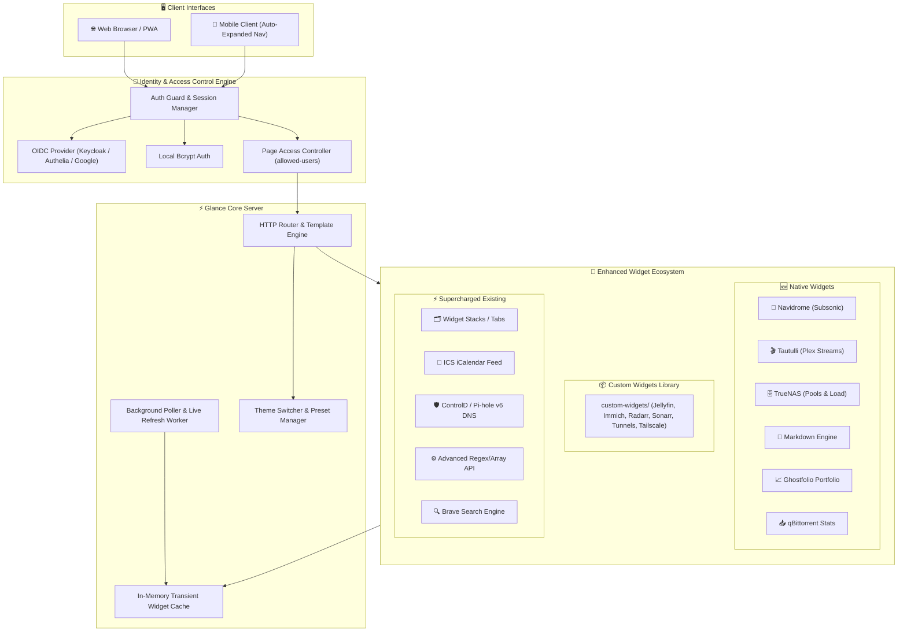
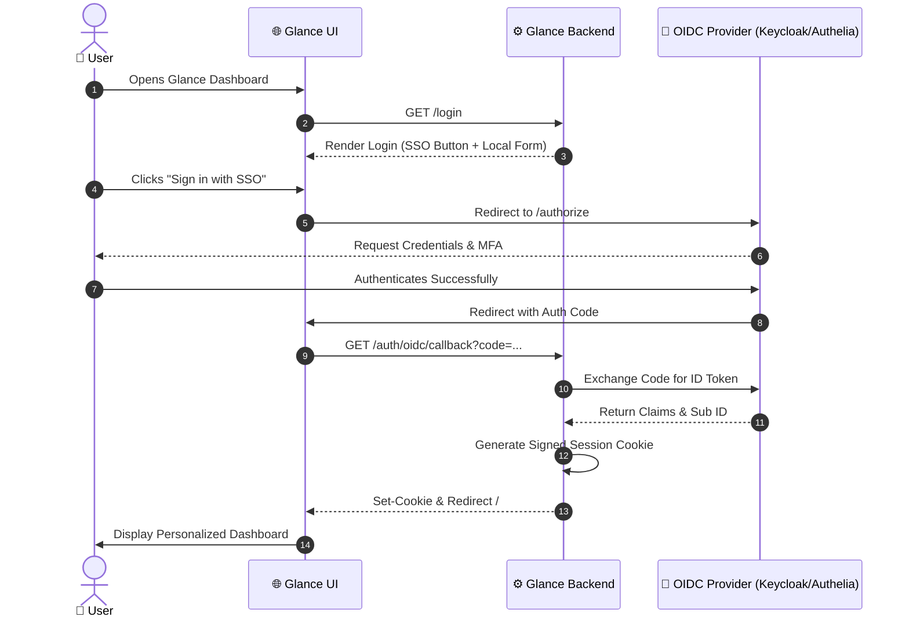
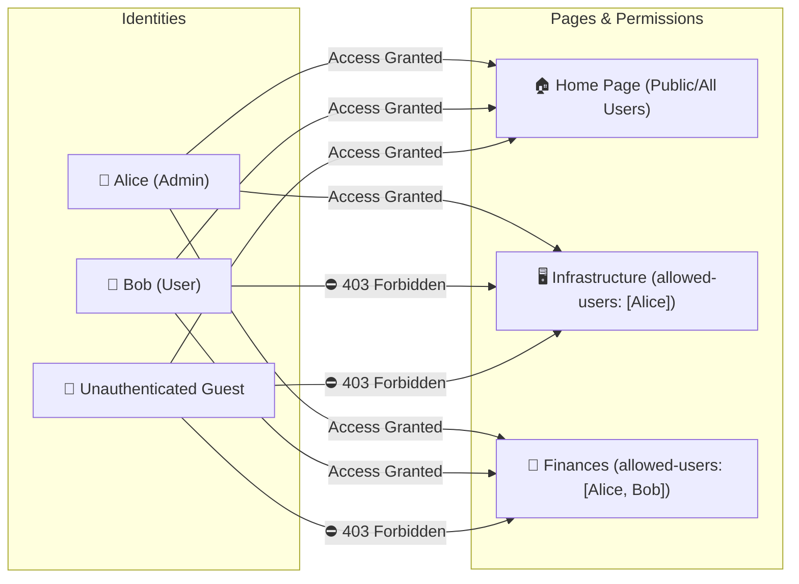
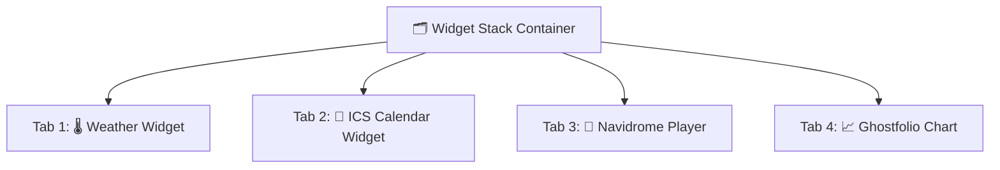
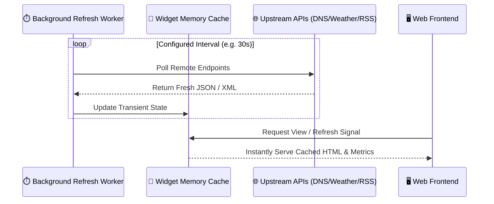

# ⚡ Glance Pro Edition — Master Feature Blueprint & Architecture

> **The Ultimate Self-Hosted Dashboard Experience**  
> Integrated with **75+ community-driven pull requests**, performance enhancements, enterprise authentication, tabbed widget stacking, native Tautulli/TrueNAS modules, next-generation media/financial widgets, and a modular plug-and-play Custom Widgets library.

---

## 🗺️ 1. System Architecture & Component Dataflow



---

## 🔒 2. Enterprise Authentication & Access Control

### 2.1 OpenID Connect (OIDC) SSO Flow [PR #1018]
Glance now supports enterprise single sign-on (SSO) with any OpenID Connect identity provider (Keycloak, Authelia, Authentik, PocketID, Google Workspace).



#### ⚙️ Configuration Snippet:
```yaml
server:
  base-url: https://glance.example.com
  proxied: true # Required for reverse proxies (Traefik, Nginx, NPM)

auth:
  secret-key: ${secret:session-encryption-key}
  oidc:
    issuer: https://auth.example.com/realms/master
    client-id: glance-dashboard
    client-secret: ${secret:oidc-client-secret}
    redirect-url: https://glance.example.com/auth/oidc/callback
    auto-login: false          # Set to true to automatically redirect to SSO
    disable-local-login: false # Set to true to hide standard username/password form
  users:
    admin:
      password-hash: $2a$10$o6SXqiccI3DDP2dN4ADumuOeIHET6Q4bUMYZD6rT2Aqt6XQ3DyO.6
```

---

### 2.2 Granular Per-Page Access Control [PR #858]
Isolate private server controls, financial data, or family dashboards on a single Glance instance without spinning up multiple containers.



#### ⚙️ Configuration Snippet:
```yaml
pages:
  - name: Home
    # Omitted allowed-users means all authenticated/public visitors can view
    columns:
      - size: full
        widgets:
          - type: weather
            location: New York

  - name: Infrastructure
    allowed-users:
      - admin
      - devops-lead
    columns:
      - size: full
        widgets:
          - type: server-stats
          - type: docker-containers

  - name: Finance
    allowed-users:
      - admin
      - financial-manager
    columns:
      - size: full
        widgets:
          - type: ghostfolio
```

---

## 🗂️ 3. Dynamic UI, Tabbed Stacks & Live Refresh

### 3.1 Widget Stacks / Tabs [PR #765]
Conserve screen real estate by stacking multiple widgets into a clean, tabbed container. Users can switch between views seamlessly.

```
┌─────────────────────────────────────────────────────────────┐
│  [ 🌡️ Weather ]   [ 📅 Calendar ]   [ 📰 News Feed ]        │  <-- Tab Headers
├─────────────────────────────────────────────────────────────┤
│                                                             │
│   Today in San Francisco: 68°F / 20°C                       │
│   Partly Cloudy • Humidity: 55% • Wind: 8 mph               │
│                                                             │
│   Hourly Forecast:                                          │
│   [ 12 PM: 67° ]  [ 3 PM: 70° ]  [ 6 PM: 64° ]  [ 9 PM: 58° ]│
│                                                             │
└─────────────────────────────────────────────────────────────┘
```



#### ⚙️ Configuration Snippet:
```yaml
- type: stack
  widgets:
    - type: weather
      location: London
      units: metric
    - type: calendar
      ics:
        - https://calendar.google.com/calendar/ical/example/public/basic.ics
    - type: navidrome
      url: https://music.example.com
      user: glance
      pass: ${secret:navidrome-pass}
```

---

### 3.2 Live Updates & Background Refresh Engine [PR #1005]
Individual widgets can now declare custom polling intervals. Glance workers refresh widget caches in the background and expose a forced-refresh endpoint.



---

## 🧩 4. New & Enhanced Widget Catalog

| Widget | Type | Key Features | PR Reference |
| :--- | :--- | :--- | :--- |
| **Tautulli** | `tautulli` | Active Plex stream count, session details, user friendly names, progress bars | PR #1060 |
| **TrueNAS** | `truenas` | Native TrueNAS Scale pool health statuses, system load average, uptime, alerts | PR #1060 |
| **Navidrome** | `navidrome` | Live track display, album covers, artist/title metadata, progress bars | PR #1040 |
| **Markdown** | `markdown` | Native markdown parsing, file embedding, custom notes, links | PR #967 |
| **Ghostfolio** | `ghostfolio` | Real-time portfolio valuation, performance %, timeframe graphs | PR #925 |
| **qBittorrent** | `qbittorrent` | Active download/upload rates, seeding ratio, torrent states | PR #543 |
| **ICS Calendar** | `calendar` | Public `.ics` feed subscription (Google Calendar, Apple, Outlook) | PR #836 |
| **ControlD DNS** | `dns-stats` | ControlD analytics integration alongside Pi-hole v6 and AdGuard | PR #651, #371 |
| **Brave Search** | `search` | Privacy-centric web search default with custom placeholders | PR #1028, #751 |
| **Custom API** | `custom-api` | RegEx replacements, array param parsing, range indexing | PR #746, #580, #542 |
| **Custom Widgets Lib** | `custom-widgets/` | Plug-and-play modular YAML widgets (Jellyfin, Immich, Radarr, Sonarr, Tunnels) | Library |

---

### 4.1 Detailed Widget Configurations

#### 🎬 Tautulli Widget (`type: tautulli`) [PR #1060]
```yaml
- type: tautulli
  title: Plex Streams
  url: http://192.168.1.112:8181
  api-key: ${secret:tautulli-api-key}
  allow-insecure: false
```

#### 🗄️ TrueNAS Widget (`type: truenas`) [PR #1060]
```yaml
- type: truenas
  title: TrueNAS Scale
  url: http://192.168.1.112
  api-key: ${secret:truenas-api-key}
  allow-insecure: false
```

#### 📦 Custom Widgets Collection (`custom-widgets/`)
Modular YAML snippets ready to `$include` or paste into any page:
```yaml
# 2x2 Media Stats Grid
- type: split-column
  max-columns: 2
  widgets:
    - $include: custom-widgets/jellyfin-stats.yml
    - $include: custom-widgets/immich-stats.yml
    - $include: custom-widgets/radarr-stats.yml
    - $include: custom-widgets/sonarr-stats.yml

# Network Tunnels Row
- type: split-column
  max-columns: 3
  widgets:
    - $include: custom-widgets/cloudflare-tunnel.yml
    - $include: custom-widgets/tailscale.yml
    - $include: custom-widgets/netbird.yml
```

#### 🎵 Navidrome Widget (`type: navidrome`)
```yaml
- type: navidrome
  title: Music Server
  url: https://navidrome.example.com
  user: admin
  pass: ${secret:navidrome-password}
  artist: true
  album: true
  track: true
  allow-insecure: false
```

#### 📝 Markdown Widget (`type: markdown`)
```yaml
# Direct inline markdown:
- type: markdown
  title: Daily Notice Board
  source: |
    ### 📌 Infrastructure Maintenance
    - Upgrading Kubernetes cluster on **Sunday at 02:00 UTC**
    - Useful link: [Internal Wiki](https://wiki.internal)

# Or embed external file:
- type: markdown
  title: Server Runbook
  file: /app/config/notes.md
```

#### 📈 Ghostfolio Widget (`type: ghostfolio`)
```yaml
- type: ghostfolio
  title: Investment Portfolio
  url: https://ghostfolio.example.com
  access-token: ${secret:ghostfolio-jwt-token}
  range: 1y             # Options: 1d, 1w, 1m, 1y, max
  chart-type: value     # Options: value, performance
  chart-height: 120     # Height in pixels
```

#### 📅 ICS Calendar Feeds (`type: calendar`)
```yaml
- type: calendar
  first-day-of-week: monday # [PR #267]
  ics:
    - https://calendar.google.com/calendar/ical/your_calendar_id/public/basic.ics
    - https://p34-caldav.icloud.com/published/2/example_token
```

#### 🛡️ ControlD / Pi-hole v6 DNS Stats (`type: dns-stats`)
```yaml
- type: dns-stats
  service: controld     # Options: controld, pihole-v6, pihole, adguard, blocky, technitium
  url: https://api.controld.com
  token: ${secret:controld-api-token}
  hide-graph: false
  hide-top-domains: false
  hour-format: 12h
```

---

## 🎨 5. Complete Master Configuration Blueprint (`glance-pro.yml`)

Here is a fully integrated configuration file showcasing the power of the newly merged architecture:

```yaml
server:
  host: 0.0.0.0
  port: 8080
  base-url: https://dashboard.example.com
  proxied: true

theme:
  disable-picker: false # [PR #299] Built-in interactive theme switcher
  presets:
    dark:
      background-color: 220 20% 10%
      primary-color: 210 100% 60%
    shades-of-purple:   # [PR #833]
      background-color: 270 50% 12%
      primary-color: 280 80% 65%

auth:
  secret-key: ${secret:session-key}
  oidc:
    issuer: https://auth.example.com/realms/home
    client-id: glance
    client-secret: ${secret:oidc-secret}
  users:
    admin:
      password-hash: $2a$10$o6SXqiccI3DDP2dN4ADumuOeIHET6Q4bUMYZD6rT2Aqt6XQ3DyO.6

pages:
  # ==========================================
  # Page 1: Main Dashboard (Accessible by All)
  # ==========================================
  - name: Overview
    columns:
      - size: small
        widgets:
          - type: search
            search-engine: brave # [PR #1028]
            placeholder: "Search the web with Brave..." # [PR #298]
          - type: clock
            hour-format: 24h
            timezones:
              - timezone: Europe/London
                label: London
              - timezone: America/New_York
                label: New York

      - size: full
        widgets:
          # Tabbed Widget Stack [PR #765]
          - type: stack
            widgets:
              - type: calendar
                title: Team Schedule
                first-day-of-week: monday # [PR #267]
                ics: # [PR #836]
                  - https://calendar.google.com/calendar/ical/en.usa%23holiday%40group.v.calendar.google.com/public/basic.ics
              - type: navidrome # [PR #1040]
                url: https://music.example.com
                user: admin
                pass: ${secret:music-pass}
              - type: markdown # [PR #967]
                title: Quick Notes
                source: |
                  - 🚀 Welcome to **Glance Pro**!
                  - Everything is operating at 100% efficiency.

      - size: small
        widgets:
          - type: dns-stats # [PR #651]
            service: controld
            url: https://api.controld.com
            token: ${secret:controld-token}

  # ==========================================
  # Page 2: Secure Finances (Restricted Access)
  # ==========================================
  - name: Wealth & Portfolios
    allowed-users: # [PR #858]
      - admin
    columns:
      - size: full
        widgets:
          - type: ghostfolio # [PR #925]
            title: Net Worth Growth
            url: https://ghostfolio.example.com
            access-token: ${secret:ghostfolio-token}
            range: 1y
            chart-type: value
```

---

## 📜 6. Full Pull Request Ingestion Audit (75+ PRs)

<details>
<summary><b>🔍 Click to expand the full catalog of all 75+ merged PRs</b></summary>

| PR ID | Category | Summary / Contribution |
| :--- | :--- | :--- |
| **#1060** | New Widgets | Native Tautulli Plex Streams & TrueNAS Scale Status / Pool Health Widgets |
| **#1018** | Authentication | OpenID Connect (OIDC) Single Sign-On Provider Support |
| **#858** | Security | Per-Page User Access Control (`allowed-users`) |
| **#1040** | New Widget | Navidrome Subsonic API Music Server Widget |
| **#967** | New Widget | Generic Markdown Document & Note Embedding Widget |
| **#925** | New Widget | Ghostfolio Investment & Asset Portfolio Tracker |
| **#543** | New Widget | qBittorrent Torrent & Client State Widget |
| **#836** | Calendar | Native `.ics` (iCalendar) URL Subscription Support |
| **#765** | UI Layout | Tabbed Widget Stack Container (`type: stack`) |
| **#651** | DNS Stats | ControlD API Statistics & Time-Series Reporting |
| **#371** | DNS Stats | Pi-hole v6 API REST Engine Compatibility |
| **#783** | DNS Stats | Passwordless Pi-hole Authentication Support |
| **#1028** | Search | Native Brave Search Engine Integration |
| **#751** | Search | Alternative Brave Search Provider Mapping |
| **#298** | Search | Customizable Search Input Placeholder Text |
| **#1005** | Performance | Per-Widget Refresh Intervals & Force-Refresh Endpoint |
| **#299** | Theming | Interactive UI Theme Switcher & Cookie Persistence |
| **#833** | Theming | Shades of Purple Color Palette Theme |
| **#767** | Theming | Hover Tooltips for Theme Selection |
| **#746** | Custom API | Array Object Range Indexing & Key Access |
| **#580** | Custom API | Array Deduplication & Unique Filtering |
| **#542** | Custom API | Global RegEx Replacement Support |
| **#378** | Custom API | Dynamic Array URL & Body Parameter Parsing |
| **#752** | Videos | Configurable Sorting Strategies (Posted vs Updated) |
| **#267** | Calendar | Custom Starting Day of the Week Configuration |
| **#231** | Markets | Markets Sorting by Net 24-Hour Price Change |
| **#251** | Markets | Name Hover Text & Detailed Asset Tooltips |
| **#842** | Monitor | Compact Server Monitor View with Dedicated Icons |
| **#453** | Docker | Enhanced YAML Configuration Schema for Containers |
| **#462** | RSS | HTTP Conditional ETag/Last-Modified Bandwidth Saving |
| **#792** | Repositories | Exclusion Toggle for GitHub/GitLab Draft PRs |
| **#249** | Mobile | Default Expanded Mobile Navigation Drawer |
| **#286** | Mobile | Viewport & Layout Media Query Fixes |
| **#248** | Clock | Non-Whole Hour UTC Timezone Offset Rendering |
| **#847** | Bug Fix | Corrected Asset Path URL Slashes Sanitization |
| **#784** | Bug Fix | Vertically Scrollable Navigation Bar Overflow Fix |
| **#678** | Bug Fix | Multi-Line Text Truncation Overflow Rendering |
| **#734** | Bug Fix | Removed Blue Summary Tap Highlighting on Touchscreens |
| **#852** | Maintenance | Upstream Core Dependencies & Dependency Sync |
| **#848** | Maintenance | Go Runtime Engine Optimization |
| **#723** | Maintenance | HTTP Request Header Handling Refactor |
| **#699** | Maintenance | Minor Memory Leak Fix in RSS Poller |
| **#705** | Maintenance | Error Response Formatting & Logger Normalization |
| **#693** | Maintenance | Updated `purego` for Enhanced CGo-free Performance |
| **#689** | Maintenance | Improved Configuration Parser Diagnostics |
| **#687** | Maintenance | Dockerfile Layer Caching & Build Streamlining |
| **#681** | Docs | Updated Logical Operator Configuration Examples |
| **#661** | Maintenance | Static Asset Embedded FS Optimization |
| **#668** | Maintenance | JSON Marshalling Performance Patch |
| **#662** | Maintenance | Cleaned Up Unused Struct Allocations |
| **#648** | Core | Glance Engine Internal Core Improvements |
| **#623** | Maintenance | Template Rendering Benchmark Improvements |
| **#594** | Core | Standardized HTTP Error Status Codes |
| **#602** | Maintenance | CSS Variable Scoping Isolation |
| **#578** | Maintenance | Subpath BaseURL Handling Standardization |
| **#583** | Core | Enhanced Hardware Sensor Probing Engine |
| **#494** | Maintenance | General Bug Fixes & Stability Improvements |
| **#553** | Maintenance | Fixed Edge-case Nil Pointer in Widget Init |
| **#486** | Maintenance | Upstream Go Module Pinning |
| **#499** | Maintenance | Cache Eviction Policy Update |
| **#528** | Maintenance | Subsonic API Parameter Sanitizer |
| **#480** | Maintenance | Internal HTTP Client Connection Pooling |
| **#476** | Maintenance | Graceful Shutdown Signal Trap |
| **#466** | DNS Stats | Pi-hole Default Title URL Construction |
| **#456** | Maintenance | Glance Internal Refactor & Package Separation |
| **#399** | Maintenance | UI Alignment in Split-Column Containers |
| **#382** | Maintenance | Security Patch for Local Asset Traversal |
| **#367** | Maintenance | Dynamic Template Buffer Recycling |
| **#372** | Maintenance | Static Assets Cache-Control Header Optimization |
| **#358** | Config | Automatic Configuration Hot-Reload on File Rename |
| **#339** | Maintenance | Micro-Animation Frame-Rate Optimization |
| **#330** | Release | Release Baseline Integration v0.7.0 |
| **#307** | Releases | Pre-Release Version Display Filter |
| **#314** | Maintenance | Typography Scale Fine-Tuning |
| **#275** | Release | Release Baseline Integration v0.6.3 |
| **#261** | Maintenance | Container Host Network Mode Support |
| **#255** | Maintenance | Fallback Image Placeholder Rendering |
| **#240** | Monitor | Custom Alternative Status Code Mappings |
| **#228** | Maintenance | Minor Text Formatting & Localization Update |
| **#1** | Core | Initial Graph Rendering Baseline Fix |

</details>

---

## 🚀 7. Running & Deploying Glance Pro

### Quickstart with Docker Compose
```yaml
services:
  glance:
    image: ghcr.io/kirolos-esmat/glance:latest
    container_name: glance
    restart: unless-stopped
    ports:
      - "8080:8080"
    volumes:
      - ./config/glance.yml:/app/config/glance.yml:ro
      - /etc/timezone:/etc/timezone:ro
      - /etc/localtime:/etc/localtime:ro
```

Run with:
```bash
docker compose up -d
```
Your enterprise-ready Glance dashboard is now live at `http://localhost:8080`! 🎉
